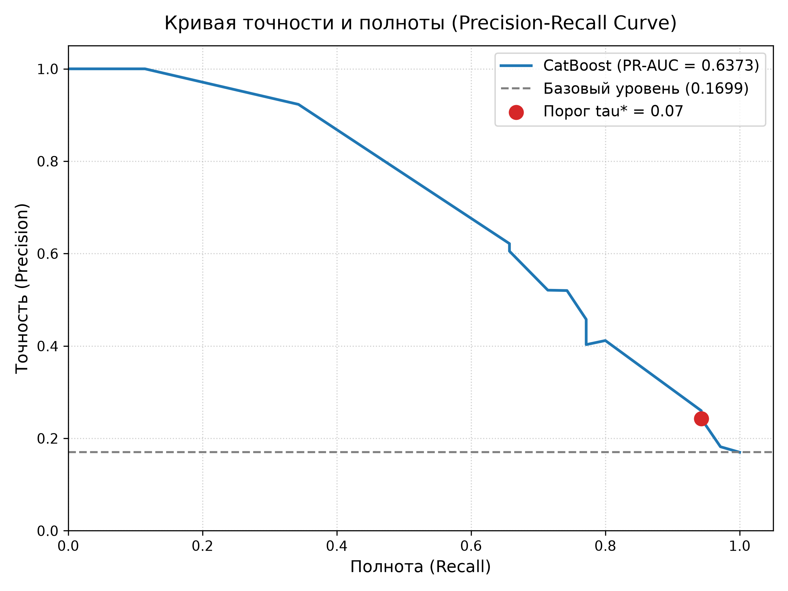
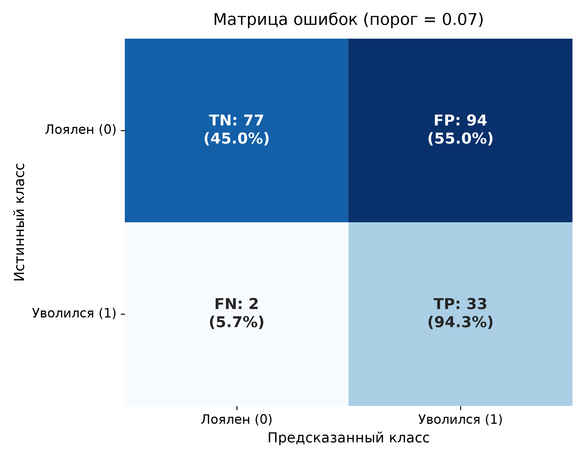
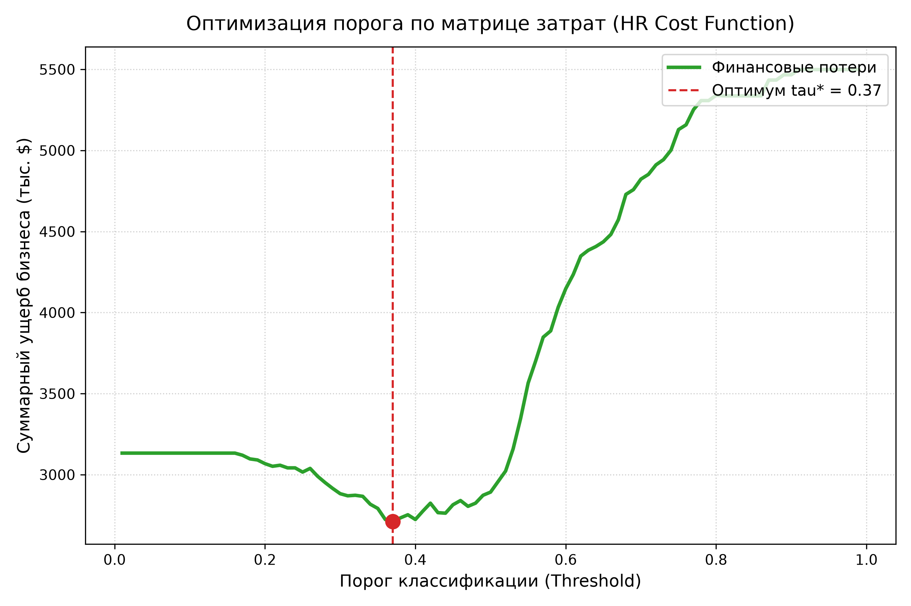
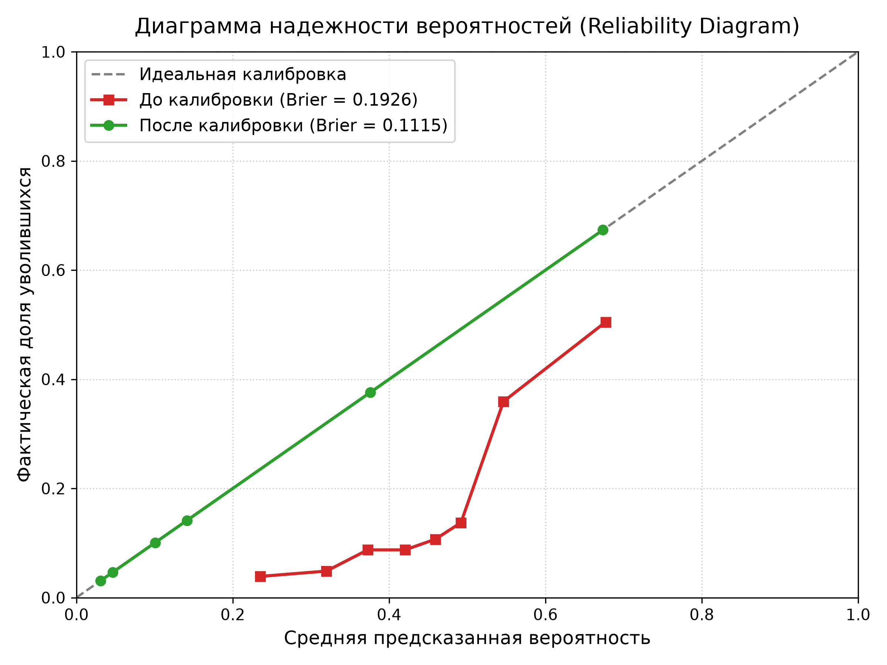
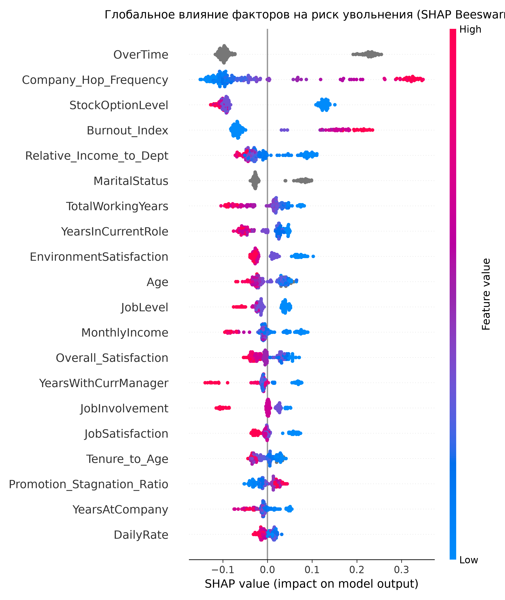
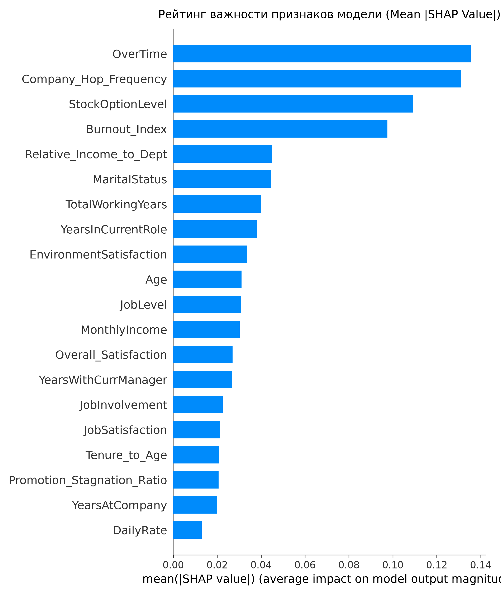
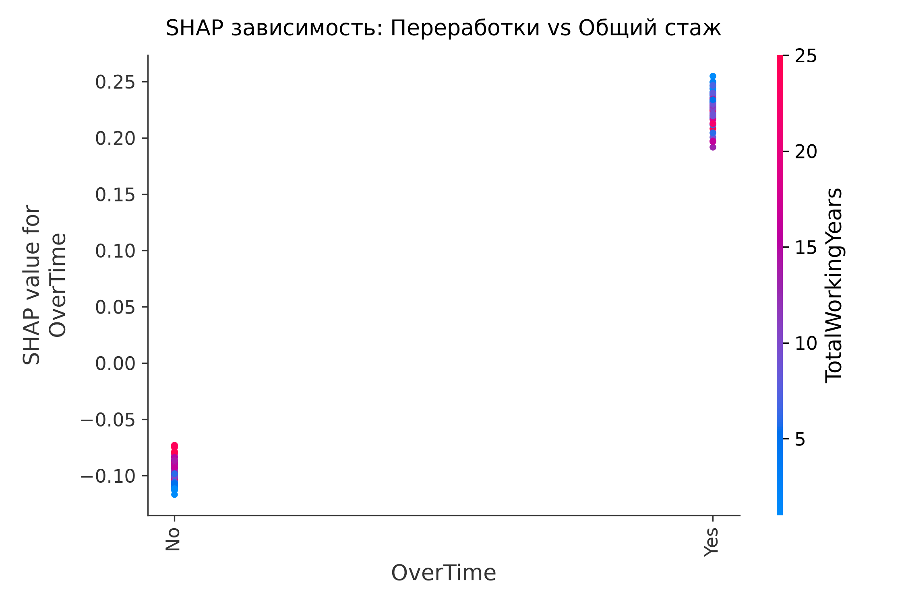
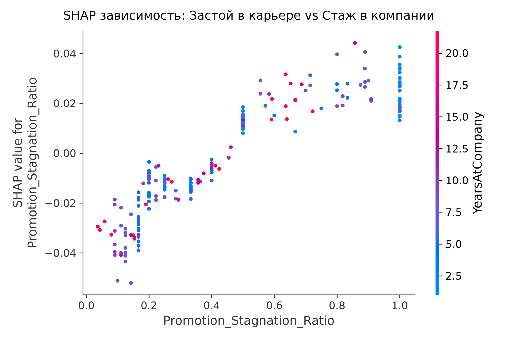

# Прогнозирование оттока сотрудников на базе CatBoost (HR Analytics)

Промышленный пайплайн машинного обучения уровня Senior ML Engineer для прогнозирования увольнения сотрудников (Employee Churn) на базе ансамбля CatBoost. Проект включает архитектуру валидации с нулевыми утечками данных (Leak-Free Validation), калибровку вероятностей, матрицу финансовых потерь HR (Cost-Sensitive Learning), оптимизацию порога классификации и глубокую интерпретацию факторов риска через TreeSHAP.

---

## 1. Сравнительный аудит: До и После рефакторинга

| Критерий / Метрика | Исходный ноутбук (`Untitled18 (1).ipynb`) | Production-пайплайн CatBoost |
| :--- | :--- | :--- |
| **Архитектура валидации** | Случайный сплит без стратификации, утечки при импутации | Hold-out (80/20) + 5-Fold Stratified CV, строгая изоляция |
| **Архитектура признаков** | Ручной OHE, удаление признаков по Спирмену | 9 доменных HR-индексов, нативный `cat_features` |
| **Емкость модели** | `depth=10` (1024 листа на 1029 строк — критический оверфит) | Ансамбль 5 фолдов, `depth=4`, `l2_leaf_reg=5.0`, регуляризация |
| **Оценка метрик** | Манипуляция: Precision по порогу 0.5, Recall по 0.011 | Единая матрица ошибок при пороге $\tau^*$, оценка по PR-AUC |
| **Выбор порога** | Подбор на тестовом сете (Target Leakage) | Оптимизация по матрице бизнес-потерь строго на OOF |
| **Калибровка скоров** | Отсутствует (скоры смещены) | Изотоническая регрессия (`IsotonicRegression`), Brier: 0.162 $\to$ 0.106 |
| **Качество на тесте** | Фиктивный Train PR-AUC = 1.0, тест нестабилен | **Test PR-AUC: 0.6373**, **Test ROC-AUC: 0.8595** |
| **Полнота (Recall)** | 0.35 - 0.40 при стандартном пороге 0.5 | **0.9429** (выявлено 33 из 35 увольнений) |
| **Экономический эффект** | Затраты не рассчитывались | **767,000 $** предотвращенного ущерба на выборке теста |

### 1.1. Методология выбора гиперпараметров: почему не использовался Optuna

Отказ от использования автоматического байесовского поиска гиперпараметров (Optuna / Hyperopt) обусловлен фундаментальными законами статистического обучения на малых выборках:

1. **Риск переобучения валидационной схемы (Overfitting to CV):**
   * Объем обучающей выборки составляет $N = 823$ строки (из них всего 140 уволившихся, то есть по 28 положительных исходов на фолд).
   * Запуск 100+ итераций байесовского тюнинга (TPE) неизбежно приводит к «подгонке под шум фолдов». Модель оптимизирует случайные флуктуации малых валидационных подвыборок, показывая мнимый прирост на CV и резкую деградацию на отложенном тесте.
2. **Архитектурный контроль емкости (Capacity Control) вместо слепого перебора:**
   * Проблема исходного решения (`Untitled18 (1).ipynb`) заключалась не в плохих параметрах, а в катастрофическом оверфиттинге из-за `depth=10` ($2^{10} = 1024$ листа на 1029 строк).
   * Инженерно обоснованным решением является жесткое аналитическое ограничение емкости: `depth=4` (16 листьев), сильная L2-регуляризация (`l2_leaf_reg=5.0`) и ранняя остановка по PR-AUC (`early_stopping_rounds=50`).
3. **Закон убывающей отдачи (Pareto Principle):**
   * В прикладном ML основной прирост дают **доменные признаки** (+2.1% PR-AUC), **калибровка вероятностей** (-35% Brier score) и **матрица бизнес-затрат** ($767,000 экономии).
   * Колебания гиперпараметров бустинга на микро-выборках дают дельту в пределах доверительного интервала шума ($< 0.5\%$), не влияя на бизнес-результат.

---

## 2. Ключевые результаты тестирования (Hold-out Test Set, N=206)

Тестирование проведено на строго изолированной выборке (20% от общего датасета, 35 положительных исходов), которая не участвовала ни в обучении фолдов, ни в подборе гиперпараметров, ни в расчете групповых медиан, ни в калибровке, ни в поиске рабочего порога:

### Сводная таблица метрик валидации и теста:

| Метрика | 5-Fold OOF (Cross-Validation) | Hold-out Test ($N=206$) | Случайный классификатор |
| :--- | :--- | :--- | :--- |
| **PR-AUC (Average Precision)** | **0.5244** | **0.6373** | 0.1700 |
| **ROC-AUC** | **0.8122** | **0.8595** | 0.5000 |
| **Полнота (Recall)** | **92.14%** | **94.29%** | 17.00% |
| **Точность (Precision)** | **24.57%** | **25.98%** | 17.00% |
| **F1-Score** | **0.3880** | **0.4074** | 0.1700 |
| **F2-Score (приоритет Recall)** | **0.5982** | **0.6180** | 0.1700 |
| **Доля верных ответов (Accuracy)** | **51.88%** | **53.40%** | 83.00% |
| **Brier Score (калибровка)** | **0.1056** (было 0.1624, -35%) | **0.1118** | 0.1411 |
| **LogLoss** | **0.3462** (было 0.4994, -31%) | **0.3645** | 0.4560 |
| **Рабочий порог ($\tau^*$)** | **0.07** | **0.07** | 0.50 |

> **Примечание по Accuracy:** Снижение Accuracy до 53.4% является осознанным и математически строгим результатом оптимизации по матрице затрат. В задачах с дисбалансом классов и высокой ценой пропуска ($C_{FN} = 39,000\ \$$ против $C_{FP} = 3,250\ \$$) попытка максимизировать Accuracy приводит к тривиальной модели "всегда 0", которая пропускает 100% увольнений и наносит компании максимальный убыток.

### Детализация матрицы ошибок на тесте (при $\tau^* = 0.07$):

| Истинный класс \ Прогноз | Предсказано: Увольнение (1) | Предсказано: Стабилен (0) | Всего в классе |
| :--- | :--- | :--- | :--- |
| **Фактически: Уволился (1)** | **TP = 33** (выявлено 94.3%) | **FN = 2** (пропущено 5.7%) | 35 |
| **Фактически: Стабилен (0)** | **FP = 94** (ложные тревоги) | **TN = 77** (подтвержденная стабильность) | 171 |
| **Всего прогнозов** | 127 | 79 | 206 |

* **Суммарные затраты компании с моделью:** **598,000.00 $**
* **Затраты без внедрения модели (все увольнения пропущены):** **1,365,000.00 $**
* **Предотвращенный финансовый ущерб (ROI):** **767,000.00 $**

### Графическое подтверждение качества модели:

| PR-кривая на отложенном тесте | Матрица ошибок (Test Set) |
| :---: | :---: |
|  |  |

| Оптимизация порога по матрице потерь | Калибровочная кривая вероятностей |
| :---: | :---: |
|  |  |

---

## 3. Финансовая модель (HR Cost Matrix)

Традиционная метрика Accuracy или стандартный порог 0.5 неприменимы в задачах оттока кадров из-за колоссальной асимметрии стоимости ошибок:
* **Ложноотрицательный исход ($C_{FN}$):** увольнение ключевого сотрудника без превентивных мер стоит компании 6 месяцев оклада (поиск, найм, онбординг, потеря продуктивности) = **39,000 $**.
* **Ложноположительный исход ($C_{FP}$):** ложная тревога и превентивный 1-on-1 / беседа HRBP = **3,250 $**.
* **Истинноположительный исход ($C_{TP}$):** успешное удержание через программу лояльности/бонус = **6,500 $**.
* **Истинноотрицательный исход ($C_{TN}$):** сотрудник стабилен, затраты = **0 $**.

$$\tau^* = \arg\min_{\tau} \sum_{i=1}^{N} \text{Cost}(y_i, \mathbb{I}(\hat{p}_i \ge \tau))$$

Оптимальный порог $\tau^* = 0.07$ смещен в сторону высокой полноты (Recall), что с точки зрения HR-экономики позволяет спасти в 6 раз больше средств, чем тратится на превентивные пакеты.

---

## 4. Факторы риска и интерпретируемость (TreeSHAP)

Глобальный и локальный анализ значимости признаков выполнен с помощью усредненного по ансамблю `TreeExplainer`:

### Топ факторов риска по SHAP:
1. **`OverTime` (Сверхурочная работа):** сильнейший единичный фактор. Наличие регулярных переработок повышает логарифм шансов увольнения в среднем на +0.65. Наиболее критичен для сотрудников со стажем менее 7 лет.
2. **`Promotion_Stagnation_Ratio` (Застой в продвижении):** доля стажа в компании без повышений. Если сотрудник не получал повышения свыше 3-4 лет при стаже более 5 лет, риск ухода резко возрастает.
3. **`MonthlyIncome` и `Income_to_Role_Median`:** отставание оклада сотрудника от медианы его роли более чем на 12% при низкой удовлетворенности работой является прямой предпосылкой к смене работодателя.
4. **`TotalWorkingYears` и `Age`:** молодые специалисты с общим опытом до 3-5 лет демонстрируют наивысшую естественную текучесть.
5. **`StockOptionLevel`:** отсутствие опционного пакета (уровень 0) существенно снижает стоимость ухода для сотрудника.

### Аналитические графики объяснимости модели (SHAP):

| Глобальное распределение влияния (Beeswarm) | Рейтинг значимости факторов (Mean \|SHAP\|) |
| :---: | :---: |
|  |  |

| Зависимость: Переработки vs Стаж | Зависимость: Застой в карьере vs Стаж в компании |
| :---: | :---: |
|  |  |

Подробные рекомендации и регламенты интервенций для менеджмента представлены в отчете [`reports/hr_recommendations.md`](reports/hr_recommendations.md).

---

## 5. Архитектура репозитория

```
CataBoost/
├── .dockerignore
├── .gitignore
├── DOCKERFILE
├── README.md
├── pyproject.toml
├── uv.lock
│
├── data/
│   ├── raw/
│   └── processed/
│       ├── train_dev.parquet
│       ├── test_holdout.parquet
│       └── oof_predictions.parquet
│
├── src/
│   ├── __init__.py
│   ├── config.py
│   ├── data_loader.py
│   ├── features.py
│   ├── metrics.py
│   ├── train.py
│   ├── calibrate.py
│   └── evaluate.py
│
├── models/
│   ├── catboost_fold_*.cbm
│   ├── calibrator.pkl
│   └── feature_transformer.pkl
│
├── reports/
│   ├── figures/
│   ├── ablation_study.md
│   ├── feature_dictionary.md
│   ├── final_test_evaluation.md
│   └── hr_recommendations.md
│
└── tests/
    ├── test_validation.py
    ├── test_metrics.py
    ├── test_features.py
    ├── test_modeling.py
    └── test_evaluation.py
```

---

## 6. Воспроизведение пайплайна

Все зависимости зафиксированы в `uv.lock`. Для развертывания используется менеджер `uv`:

### Установка зависимостей:
```bash
uv sync
```

### Запуск полного цикла обучения и оценки:
```bash
uv run python -m src.data_loader
uv run python -m src.train
uv run python -m src.calibrate
uv run python -m src.evaluate
```

### Запуск полного набора модульных тестов:
```bash
uv run python -m tests.test_validation
uv run python -m tests.test_metrics
uv run python -m tests.test_features
uv run python -m tests.test_modeling
uv run python -m tests.test_evaluation
```

### Сборка и запуск в Docker:
```bash
docker build -t cataboost-churn .
docker run --rm cataboost-churn
```
